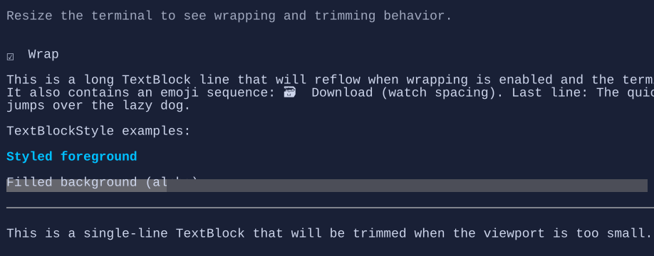

# TextBlock

`TextBlock` renders read-only text with optional wrapping, alignment, and trimming.


{.terminal}

## Basic usage

```csharp
new TextBlock("Hello, world!");
```

## Dynamic text (bindings)

`TextBlock` supports a dynamic text provider via a `Func<string>`:

```csharp
var count = new State<int>(0);

new TextBlock(() => $"Count: {count.Value}");
```

## Wrapping and trimming

```csharp
new TextBlock("This is a long line that can wrap.")
    .Wrap(true);

new TextBlock("This is a long single line that will be trimmed.")
    .Wrap(false)
    .Trimming(TextTrimming.EndEllipsis);
```

When `Wrap` is `false`, `TextBlock` can shrink horizontally during layout, so it works well in patterns such as
`Grid(Star + Auto)` where trailing actions should remain visible while the text trims.

## Alignment

`TextAlignment` controls how the text is aligned inside the available width:

```csharp
new TextBlock("Centered")
    .TextAlignment(TextAlignment.Center)
    .HorizontalAlignment(Align.Stretch);
```

## Defaults

- Default alignment: `HorizontalAlignment = Align.Start`, `VerticalAlignment = Align.Start` 

## Selection and copy

`TextBlock` supports mouse selection:

- drag with the left mouse button to select a range
- double-click to select a word
- `Ctrl+C` copies the active selection

Selection is enabled by default. Set `IsSelectable = false` to opt out.

## Styling
Use `TextBlockStyle` to override colors and decorations for a subtree (or for a single `TextBlock`):

```csharp
new TextBlock("Accent")
    .Style(TextBlockStyle.Default with
    {
        Foreground = Colors.DeepSkyBlue,
        TextStyle = TextStyle.Bold,
    });
```

To apply a background only behind the glyphs, set `Background`:

```csharp
new TextBlock("Highlighted")
    .Style(TextBlockStyle.Default with
    {
        Background = Colors.Blue,
        Foreground = Colors.White,
    });
```

To fill the whole bounds with a background, enable `FillBackground`:

```csharp
new TextBlock("Banner")
    .HorizontalAlignment(Align.Stretch)
    .Style(TextBlockStyle.Default with
    {
        Background = Colors.Blue,
        Foreground = Colors.White,
        FillBackground = true,
    });
```

To use gradients, set `ForegroundBrush` and/or `BackgroundBrush`:

```csharp
new TextBlock("Gradient title")
    .HorizontalAlignment(Align.Stretch)
    .Style(TextBlockStyle.Default with
    {
        ForegroundBrush = Brush.LinearGradient(
            new GradientPoint(0f, 0f),
            new GradientPoint(1f, 0f),
            [new GradientStop(0f, Colors.DeepSkyBlue), new GradientStop(1f, Colors.White)]),
        BackgroundBrush = Brush.LinearGradient(
            new GradientPoint(0f, 0f),
            new GradientPoint(1f, 0f),
            [new GradientStop(0f, Color.Rgb(0x1D, 0x3F, 0x62)), new GradientStop(1f, Color.Rgb(0x12, 0x20, 0x33))]),
        FillBackground = true,
    });
```

## Related

- [Binding](../binding.md)
- [Styling](../styling.md)
- [TextBlock Specs](../specs/controls/textblock.md)
