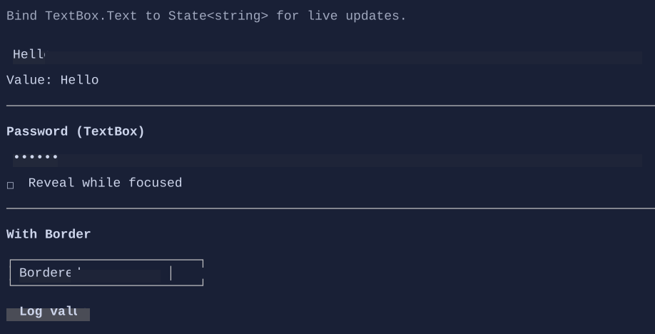

# TextBox

`TextBox` is a single-line text editor.


{.terminal}

## Basic usage

```csharp
var name = new State<string>("Alex");
new TextBox().Text(name);
```

You can also pass initial text:

```csharp
new TextBox("Hello");
```

## Editing features

- cursor navigation
- selection (keyboard and mouse)
- clipboard shortcuts (Ctrl+C/X/V) when enabled by the control mode / clipboard settings
- overflow indicators when content is wider than the viewport

## Undo / redo

TextBox supports undo/redo:

- `Ctrl+Z`: undo
- `Ctrl+R`: redo

See [Undo/Redo](../undo-redo.md).

## Password mode

`TextBox` can mask its text to behave like a password input:

```csharp
new TextBox("hunter2")
    .IsPassword(true)
    .ClipboardMode(TextBoxClipboardMode.Disabled)
    .PasswordRevealMode(PasswordRevealMode.WhileFocused);
```

Masking uses the glyph configured by `TextBoxStyle.PasswordMaskGlyph`.

## Overflow indicators

When content is wider than the viewport, the TextBox can show start/end indicators configured by `TextBoxStyle` (arrows/ellipsis variants).

## Key properties

- `Text`: the current text (bindable, supports `State<string>` two-way binding via fluent API).
- `TextAlignment`: left/center/right alignment inside the editor.
- `IsPassword`: enables masking.
- `PasswordRevealMode`: controls when the real text is revealed.
- `ClipboardMode`: enables/disables copy/cut/paste behaviors (useful for secrets).

> [!NOTE]
> In password mode, copy/cut is typically disabled so the masked value doesn’t leak via clipboard.

## Defaults

- Default alignment: `HorizontalAlignment = Align.Start`, `VerticalAlignment = Align.Start` 

## Styling
TextBox uses background on the text region while keeping borders visually compatible with the terminal background.

`TextBoxStyle` also supports brush-based gradients:

```csharp
new TextBox("Gradient-enabled")
    .Style(TextBoxStyle.Default with
    {
        BackgroundBrush = Brush.LinearGradient(
            new GradientPoint(0f, 0f),
            new GradientPoint(1f, 0f),
            [new GradientStop(0f, Color.Rgb(0x11, 0x25, 0x3D)), new GradientStop(1f, Color.Rgb(0x12, 0x20, 0x33))]),
        ForegroundBrush = Brush.LinearGradient(
            new GradientPoint(0f, 0f),
            new GradientPoint(1f, 0f),
            [new GradientStop(0f, Colors.White), new GradientStop(1f, Colors.DeepSkyBlue)]),
    });
```

See also:

- [Text Editing](../text-editing.md)
- [Binding](../binding.md)
- [Styling](../styling.md)

## Related

- [TextBox Specs](../specs/controls/textbox.md)
