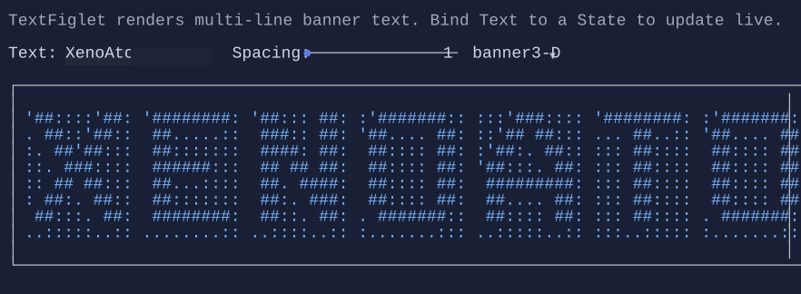

# TextFiglet

`TextFiglet` renders large banner text using a FIGlet font.


{.terminal}

## Basic usage

```csharp
new TextFiglet("Hello")
{
    Font = FigletFont.Block,
};
```

## Fonts

FIGlet fonts are represented by `FigletFont` (namespace `XenoAtom.Terminal.UI.Figlet`).

- Use `FigletFont.Block` for a built-in demo font.
- Use embedded fonts from `FigletPredefinedFont` (e.g. `FigletPredefinedFont.Standard`, `FigletPredefinedFont.Slant`).
- Load a `.flf` font from a stream with `FigletFont.Load(...)`.

## Defaults

- Default alignment: `HorizontalAlignment = Align.Start`, `VerticalAlignment = Align.Start` 

## Styling
Use `TextFigletStyle` to change the foreground/background and decorations:

```csharp
new TextFiglet("XenoAtom")
    .Style(TextFigletStyle.Default with { TextStyle = CellStyle.None | TextStyle.Bold });
```

Use brushes for gradients:

```csharp
new TextFiglet("XenoAtom")
    .Style(TextFigletStyle.Default with
    {
        ForegroundBrush = Brush.LinearGradient(
            new GradientPoint(0f, 0f),
            new GradientPoint(1f, 1f),
            [
                new GradientStop(0f, Colors.DeepSkyBlue),
                new GradientStop(0.5f, Colors.White),
                new GradientStop(1f, Colors.MediumPurple),
            ]),
    });
```

## Related

- [TextFiglet Specs](../specs/controls/textfiglet.md)
