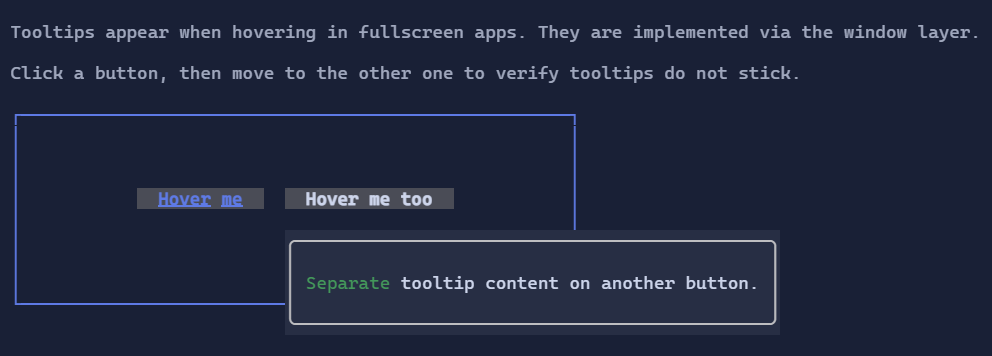

# Tooltip

Tooltips display additional information when the user hovers a visual.

{.terminal}

## Basic usage

Wrap a visual with a tooltip using the `Tooltip(...)` extension method:

```csharp
new Button("Delete")
    .Tooltip("Permanently deletes the item");
```

The returned `TooltipHost` preserves the wrapped visual's horizontal and vertical alignment.

The tooltip content is a `Visual`, so you can use `Markup` or any other control:

```csharp
new Button("Delete")
    .Tooltip(new Markup("[red]Permanently deletes the item[/]"));
```

## Delay and placement

`Tooltip(...)` returns a `TooltipHost`, allowing you to configure behavior:

```csharp
new Button("More info")
    .Tooltip("Shown above after 250ms")
    .ShowDelayMilliseconds(250)
    .Placement(PopupPlacement.Above);
```

Tooltips are implemented as a non-interactive overlay in fullscreen apps.
They are dismissed when pointer interaction begins on the host, so clicks do not leave stale tooltip overlays behind.

> [!NOTE]
> Tooltips rely on mouse hover events. In inline/live hosting, hover may not be available depending on the terminal
> and host configuration.

## Defaults

- Default alignment: `HorizontalAlignment = Align.Start`, `VerticalAlignment = Align.Start` 

## Related
- [Popup](popup.md)
- [Input](../input.md)
- [Tooltip Specs](../specs/controls/tooltip.md)
