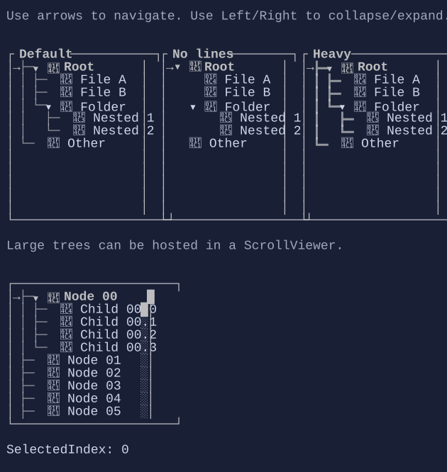

# TreeView

`TreeView` displays hierarchical nodes with expand/collapse interaction and selection.




## Basic usage

```csharp
var root = new TreeNode("Root") { IsExpanded = true };
root.Children.Add(new TreeNode("Child A"));
root.Children.Add(new TreeNode("Child B"));

new TreeView()
    .Roots([root]);
```

## Interaction

- Arrow keys move selection and expand/collapse nodes (when supported by the current node).
- Mouse click selects a row; glyph areas allow expanding/collapsing.

## Defaults

- Default alignment: `HorizontalAlignment = Align.Stretch`, `VerticalAlignment = Align.Stretch`

## Node visuals

Nodes can use glyphs/icons (e.g. folder/file) and are composable visuals.

Each node is represented by a `TreeNode`:

- `Header` is a `Visual` (anything can be used: text, markup, composed layouts).
- `Children` is a bindable list of nodes.
- `IsExpanded` controls whether children are visible.

## Styling

`TreeViewStyle` controls indentation, glyphs, spacing, and selection colors.

## Related

- [Binding](../binding.md)
- [ScrollViewer](scrollviewer.md)
