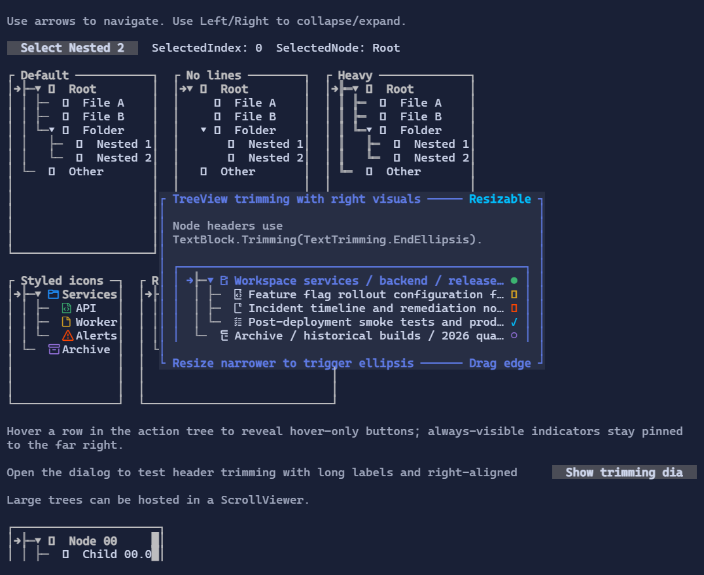

# TreeView

`TreeView` displays hierarchical nodes with expand/collapse interaction and selection.


{.terminal}

## Basic usage

```csharp
var root = new TreeNode("Root") { IsExpanded = true };
root.Children.Add(new TreeNode("Child A"));
root.Children.Add(new TreeNode("Child B"));

new TreeView()
    .Roots([root]);
```

## Interaction

- Arrow keys move selection and expand/collapse nodes (when supported by the current node).
- Mouse click selects a row; glyph areas allow expanding/collapsing.
- `SelectedIndex` is the index in the current flattened list of visible rows, not an index within `Roots` or within a parent node's `Children`.
- The flattened list contains only nodes that are currently visible after applying expansion/collapse state.
- Because of that, `SelectedIndex` can change meaning when nodes are expanded or collapsed. It is mainly useful for keyboard navigation and scroll positioning.
- `SelectedNode` exposes the selected `TreeNode` directly, so application code does not need to map the index back to a node.
- `TrySelectNode(node)` selects a visible node by reference.

## Selection example

```csharp
var root = new TreeNode("Root") { IsExpanded = true, Data = "Root" };
var child = new TreeNode("Child") { Data = "Child" };
root.Children.Add(child);

var tree = new TreeView([root]);

tree.TrySelectNode(child);
var selectedNode = tree.SelectedNode;
var selectedLabel = selectedNode?.Data as string;
```

If the visible rows are:

```text
0 Root
1 Child
2 Other
```

then `SelectedIndex == 1` means `Child` is selected. If `Root` is collapsed, the visible rows become:

```text
0 Root
1 Other
```

and `SelectedIndex == 1` now refers to `Other`. For application logic, prefer `SelectedNode`.

## Defaults

- Default alignment: `HorizontalAlignment = Align.Stretch`, `VerticalAlignment = Align.Stretch`

## Node visuals

Nodes can use glyphs/icons (e.g. folder/file) and are composable visuals.

Each node is represented by a `TreeNode`:

- `Header` is a `Visual` (anything can be used: text, markup, composed layouts).
- `Children` is a bindable list of nodes.
- `IsExpanded` controls whether children are visible.
- `Icon` controls the glyph rendered before the header.
- `IconStyle` lets you style that icon directly (for example with a custom foreground color).

```csharp
var logs = new TreeNode("Logs")
{
    Icon = TreeNodeIcons.FolderGlyph,
    IconStyle = Style.None.WithForeground(Colors.Goldenrod),
};
```

## Right-aligned row visuals

Each `TreeNode` can also expose visuals pinned to the right edge of the row.
These can be status indicators, one-cell action buttons, counters, or any other `Visual`.

- Use `RightVisuals` for direct collection access.
- Use `AddRightVisual(...)` for a fluent setup.
- `TreeNodeRightVisualVisibility.Always` keeps the visual visible whenever the node row is visible.
- `TreeNodeRightVisualVisibility.Hover` shows the visual only while the row is hovered.
- When both modes are present, always-visible visuals stay on the far right and hover-only visuals appear immediately to their left.

```csharp
var compactButtonStyle = ButtonStyle.Default with { Padding = Thickness.Zero };

var node = new TreeNode("Build pipeline")
    .AddRightVisual(
        "!",
        TreeNodeRightVisualVisibility.Always)
    .AddRightVisual(
        new Button("x")
            .Style(compactButtonStyle)
            .Tone(ControlTone.Error)
            .Click(() => Console.WriteLine("Dismissed"))
            .Margin(new Thickness(1, 0, 0, 0)),
        TreeNodeRightVisualVisibility.Hover);
```

Spacing is controlled by the visuals themselves, so margins work well for separating stacked indicators and actions.

If a node header is a text visual such as `TextBlock`, `Markup`, or `Paragraph`, trimming now works against the visible
space left before the right-aligned visual group. This makes patterns like a long label plus trailing status glyphs work
as expected:

```csharp
var node = new TreeNode(
        new TextBlock("Release candidate build pipeline for production")
        {
            Trimming = TextTrimming.EndEllipsis,
        })
    {
        Icon = TreeNodeIcons.FileGlyph,
    }
    .AddRightVisual("●");
```

When the row becomes narrower, the header trims before the trailing visual instead of drawing underneath it.

## Styling

`TreeViewStyle` controls indentation, glyphs, spacing, selection colors, and a default `IconStyle`.

## Related

- [Binding](../binding.md)
- [ScrollViewer](scrollviewer.md)
- [TreeView Specs](../specs/controls/treeview.md)
