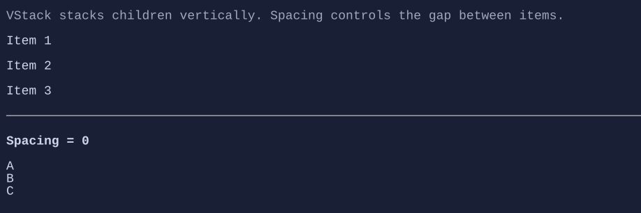

# VStack

`VStack` stacks children vertically.




## Basic usage

```csharp
new VStack(
    "First",
    "Second",
    new Button("Third")
).Spacing(1);
```

## Defaults

- Default alignment: `HorizontalAlignment = Align.Stretch`, `VerticalAlignment = Align.Start` 

See also:
- [Layout](../layout.md)
- [HStack](hstack.md)
