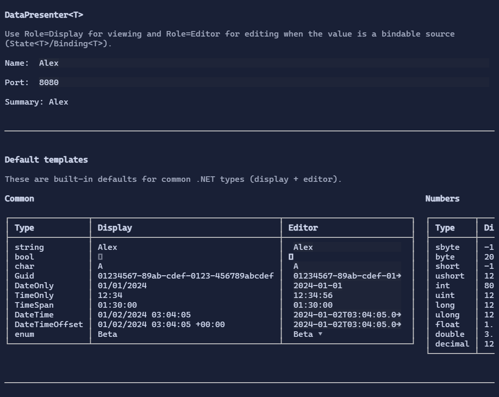

# Data templating

Many controls in XenoAtom.Terminal.UI are **data-driven**: they take a list of values (`T`) and render each value using a **data template**.

This enables:

- Environment-scoped defaults (set once, apply everywhere in a subtree)
- Per-control overrides
- Allocation-friendly virtualization/recycling (via `DataTemplate<T>.TryUpdate` and `Release`)

{.terminal}

## DataTemplates registry

The active template registry is stored in the visual environment and resolved with:

- `Visual.GetStyle<DataTemplates>()`
- `visual.Style(templates)`

`DataTemplates` is immutable and supports overlay chaining via `Derive(...)`:

```csharp
using XenoAtom.Terminal.UI.Templating;

var templates = DataTemplates.Default.Derive(builder => builder
    .Register<string>(
        DataTemplateRole.Display,
        new DataTemplate<string>(
            Display: static (DataTemplateValue<string> value, in DataTemplateContext _) => new TextBlock(() => $"> {value.GetValue()}"),
            Editor: null)));

var ui = new VStack(
        new ListBox<string>().Items(["One", "Two", "Three"]),
        new Select<string>().Items(["Alpha", "Beta"]))
    .Spacing(1)
    .Style(templates);
```

## DataPresenter<T>

`DataPresenter<T>` is the "content presenter" for data values: it hosts a single value and renders it using a resolved template.

```csharp
using XenoAtom.Terminal.UI.Templating;

var name = new State<string?>("Alex");

new VStack(
        name.PresentAs(DataTemplateRole.Display),
        name.PresentAs(DataTemplateRole.Editor))
    .Spacing(1);
```

`Editor` templates are intended for bindable sources (such as `State<T>` or `Binding<T>`), so that the editor can update the source.

## Built-in default templates

`DataTemplates.Default` includes built-in templates for common .NET types.

**Display templates** render a value in a `TextBlock` (culture-aware when possible).

**Editor templates** render an editor that can update a bindable value (for example, `State<T>` or `Binding<T>`).

The default registry currently includes:

- `string` / `string?` (TextBox editor)
- `bool` (Switch editor; display is `true`/`false` lowercase)
- `char` (TextBox editor)
- Numeric primitives: `sbyte`, `byte`, `short`, `ushort`, `int`, `uint`, `long`, `ulong`, `float`, `double`, `decimal` (NumberBox editor)
- `Guid` (TextBox editor, parses standard GUID formats)
- `DateOnly` (TextBox editor, `yyyy-MM-dd`)
- `TimeOnly` (TextBox editor, `HH:mm:ss` / `HH:mm`)
- `TimeSpan` (TextBox editor, `c`)
- `DateTime` / `DateTimeOffset` (TextBox editor, round-trip `O`)

### Enums

By default, enums have a display template (via `ToString()`), and the editor template may fall back to a text editor.
For a better UX, register a specific enum type as a dropdown editor (powered by `EnumSelect<TEnum>`):

```csharp
using XenoAtom.Terminal.UI.Templating;

var templates = DataTemplates.Default.Derive(b => b.RegisterEnum<MyEnum>());

var ui = new VStack(
        new State<MyEnum>(MyEnum.Second).PresentAs(DataTemplateRole.Editor))
    .Style(templates);
```

You can also use the control directly without registering a template:

```csharp
var mode = new State<MyEnum>(MyEnum.Second);

var ui = new EnumSelect<MyEnum>()
    .Value(mode);
```

## Per-control templates

Item controls expose template slots to override the environment:

- `Select<T>.ItemTemplate`
- `ListBox<T>.ItemTemplate`
- `OptionList<T>.ItemTemplate`
- `SelectionList<T>.ItemTemplate`

Example:

```csharp
using XenoAtom.Terminal.UI.Templating;

new Select<string>()
    .Items(["First", "Second", "Third"])
    .ItemTemplate(new DataTemplate<string>(
        Display: static (DataTemplateValue<string> value, in DataTemplateContext _) =>
            new HStack(Symbols.ArrowRight, new TextBlock(() => value.GetValue())).Spacing(1),
        Editor: null));
```

## Notes on performance and recycling

Controls may reuse visuals when items scroll in/out of view:

- `TryUpdate` allows a visual subtree to be reused for a different value.
- `Release` allows cleanup when a visual leaves the pool permanently.

For best results, templates should prefer updating bindable properties on an existing subtree rather than capturing item values in
dynamic updates that are registered once and never cleared.
