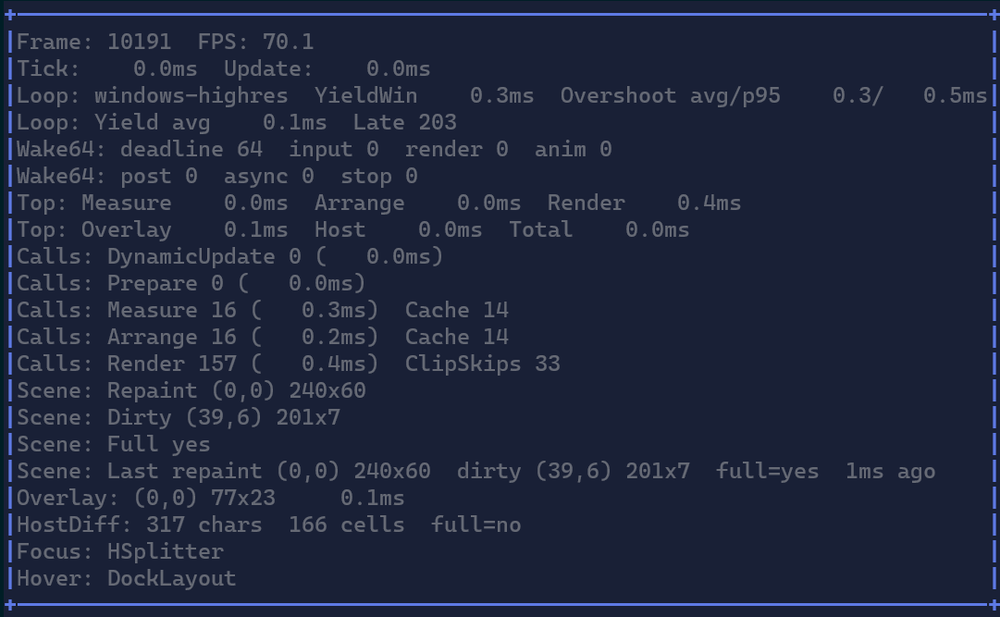

# Debugging & Performance Tools

XenoAtom.Terminal.UI includes built-in diagnostics to help you understand when and why the UI updates, and how much work
each frame performs.

## Debug overlay (F12)

In fullscreen apps (`Terminal.Run(...)`) and inline/live hosts (`Terminal.Live(...)`), press `F12` to toggle the debug
overlay.

The gesture is configurable via `TerminalAppOptions.ToggleDebugOverlayGesture` (default: `F12`).

{.terminal}

> [!TIP]
> Keep the overlay enabled while developing dynamic UIs. It makes “silent” performance bugs obvious (for example: a
> control constantly re-measuring due to an unstable binding).

## What the overlay shows

### Frame and FPS

- `Frame`: monotonically increasing render frame index.
- `FPS`: frames per second (computed from the time between frames).

If FPS is low, use the timing lines below to see which stage is expensive.

### Tick and Update

- `Tick`: total time spent in the app loop for the tick.
- `Update`: time spent in the user `onUpdate` callback (your code).

If `Update` is high, you’re likely doing too much work in your update loop (I/O, allocations, heavy computations).

### Top timings

These are top-level timings for the render pipeline:

- `Measure`: total time spent measuring the visual tree.
- `Arrange`: total time spent arranging the visual tree.
- `Render`: total time spent rendering the visual tree into the `CellBuffer`.
- `Overlay`: time spent composing the debug overlay on top of the scene buffer.
- `Host`: time spent diffing + writing output to the terminal.
- `Total`: total render frame time.

### Calls and caches

These lines show how many times each stage ran across all visuals in the frame:

- `Calls: DynamicUpdate`: how often visuals rebuilt internal children/models.
- `Calls: Prepare`: how often `PrepareChildren` ran.
- `Calls: Measure`: how many visuals were measured.
- `Calls: Arrange`: how many visuals were arranged.
- `Calls: Render`: how many visuals executed `RenderOverride`.

Cache counters indicate how many times the framework reused a previous result:

- `Cache` (Measure/Arrange): cache hits for layout.
- `ClipSkips`: render calls skipped because the visual was fully clipped.

If `Measure`/`Arrange` calls are high every frame, it often means:

- you are changing bindable state every frame (even when values don’t really change), or
- a control is reading state in a way that prevents caching (unstable dependencies).

### Scene repaint and dirty rectangles

- `Scene: Repaint`: the region of the real UI scene that the app chose to repaint for this frame.
- `Scene: Dirty`: the union of scene dirty rectangles reported during the frame.
- `Scene: Full yes/no`: whether the scene renderer used a full repaint.
- `Scene: Last ... ago`: the most recent scene repaint/dirty/full snapshot, kept visible after the app returns to idle.

When the overlay is the only thing updating, the scene lines stay at `<none>` / `no`. This is intentional: the overlay
is composed in a separate pass so it does not distort scene repaint diagnostics. The `Scene: Last ... ago` line is the
sticky context that lets you see what changed recently even after the current frame has already gone back to idle.

### Overlay composition

- `Overlay: (x,y) wxh`: the overlay rectangle on the composed frame.
- `overlay-only`: shown when the scene did not repaint and only the overlay was updated.

The overlay timing is reported separately so you can leave it on without confusing scene metrics.

### Host diff output

- `HostDiff: N chars`: how many output characters the host diff renderer wrote to the terminal.
- `HostDiff: N cells`: how many cells changed compared to the previous composed buffer.
- `full=yes/no`: whether the diff renderer forced a full redraw.

These numbers include overlay changes because they describe what the host actually wrote to the terminal.

If `HostDiff` is consistently high, you are rewriting many cells each frame (large animated regions, blinking cursors,
etc.).

### Focus and Hover

Shows the current focused and hovered visual type names. This is useful when debugging input routing and focus scopes.

## Using the overlay to optimize

### Symptom: constant Measure/Arrange every frame

Likely causes:

- some bindable property is changing each frame (even if it changes back), or
- a control reads and writes the same bindable state in one pass and triggers extra invalidations.

Start by:

1. Locate the region that animates/changes.
2. Check which stage is expensive (Measure/Arrange/Render).
3. Temporarily hide/disable parts of the tree to isolate the culprit.

### Symptom: high Render but low Diff

This usually means you are spending time rendering clipped or unchanged regions. Look at `ClipSkips`, and consider:

- reducing visual tree size,
- avoiding per-cell loops outside the clipped region,
- using virtualization (`DataGridControl`, `LogControl`) for large datasets.

## Related

- [Rendering](rendering.md)
- [Binding](binding.md)
- [Layout](layout.md)
