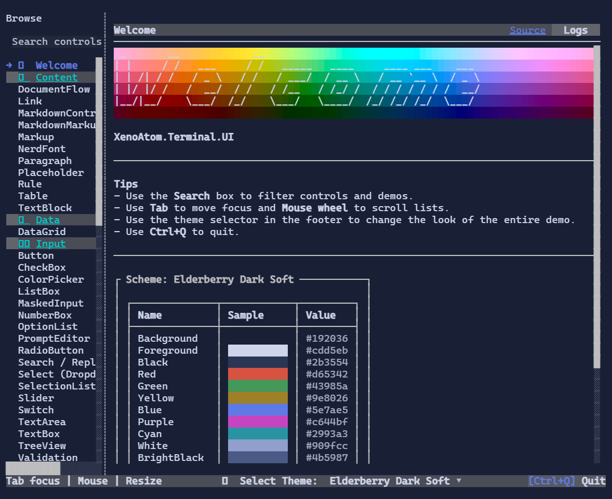

XenoAtom.Terminal.UI comes with a few runnable demos that showcase different parts of the library.

> [!TIP]
> You can run all demos directly from source with `dotnet run -c Release --project <path>`.
> These demos are also intended to be published as global .NET tools (NuGet) so you can install and run them without cloning the repository.

## ControlsDemo

{.terminal}

The ControlsDemo is the “living catalog” of the library:

- Shows most controls with real styling and interactions
- Includes theme switching and debug overlay usage
- Can export the PNG screenshots used by the website documentation

**Run from source**

```shell
dotnet run -c Release --project samples/ControlsDemo
```

**Export website screenshots**

```shell
dotnet run -c Release --project samples/ControlsDemo -- --export-screenshots
```

**Install as a tool**

```shell
dotnet tool install -g XenoAtom.Terminal.UI.ControlsDemo
xenoatom-controls-demo
```

Source: [`samples/ControlsDemo/`](https://github.com/XenoAtom/XenoAtom.Terminal.UI/tree/main/samples/ControlsDemo)

## FullscreenDemo

{.terminal}

The FullscreenDemo is a single-screen “dashboard”-style app:

- Exercises layout, focus navigation, and complex composition
- Useful for evaluating overall look & feel across themes

**Run from source**

```shell
dotnet run -c Release --project samples/FullscreenDemo
```

**Install as a tool**

```shell
dotnet tool install -g XenoAtom.Terminal.UI.FullscreenDemo
xenoatom-fullscreen-demo
```

Source: [`samples/FullscreenDemo/`](https://github.com/XenoAtom/XenoAtom.Terminal.UI/tree/main/samples/FullscreenDemo)

## InlineLiveDemo

{.terminal}

The InlineLiveDemo demonstrates **inline** live regions:

- Terminal output continues to scroll normally
- A live “widget” updates in-place inside regular output

**Run from source**

```shell
dotnet run -c Release --project samples/InlineLiveDemo
```

**Install as a tool**

```shell
dotnet tool install -g XenoAtom.Terminal.UI.InlineLiveDemo
xenoatom-inline-live-demo
```

Source: [`samples/InlineLiveDemo/`](https://github.com/XenoAtom/XenoAtom.Terminal.UI/tree/main/samples/InlineLiveDemo)
