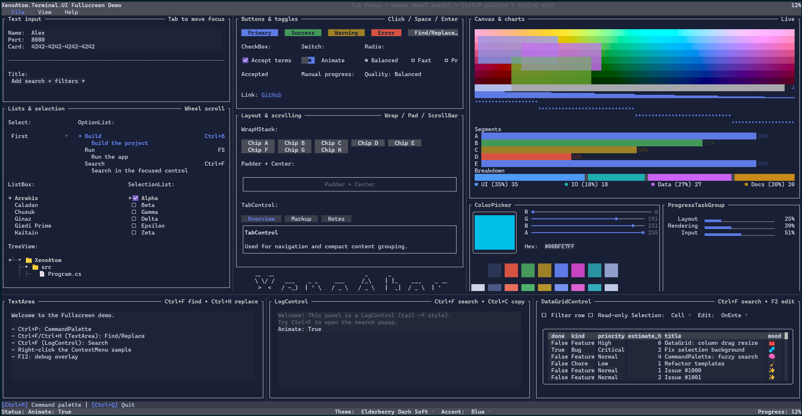

# Terminal User Guide

XenoAtom.Terminal.UI is a modern retained-mode terminal UI framework built on top of XenoAtom.Terminal.
It supports both:

- Inline widgets that render as part of normal terminal output (`Terminal.Write`, `Terminal.Live`)
- Fullscreen applications (alternate screen, focus navigation, routed input, dialogs, etc.)

This guide documents the concepts, features, and controls of the library.

{.terminal}

## Requirements (.NET 10 / C# 14)

XenoAtom.Terminal.UI targets `net10.0` and requires the .NET 10 SDK (C# 14).

Rationale: the library integrates into `XenoAtom.Terminal` using **C# 14 extension members**, so the hosting APIs are
available as `Terminal.Write(...)`, `Terminal.Live(...)`, and `Terminal.Run(...)` on the `Terminal` type coming from
the `XenoAtom.Terminal` package.

## Quick start

- [Getting Started](getting-started.md)

## Ecosystem

Terminal.UI is built on:

- [XenoAtom.Terminal](terminal.md) - terminal I/O, input events, hosting (inline + fullscreen)
- [XenoAtom.Ansi](ansi.md) - ANSI/VT primitives and markup used by the `Markup` control and parsers

See also:

- [Ecosystem & Foundations](foundations.md)

## Hosting & integration

- [Hosting](hosting.md) (inline vs fullscreen, update loops)
- [Prompts](prompts.md) (inline prompts built on top of `Terminal.Live`)

## Core concepts

- [Visual Tree](visual-tree.md) (Visuals, fluent API, dynamic composition)
- [Binding](binding.md) (`State<T>`, bindable properties, dependency tracking)
- [Data Templating](data-templating.md) (DataTemplates, DataPresenter<T>, item templates)
- [Culture](culture.md) (culture-aware value formatting)
- [Layout](layout.md) (layout protocol, alignment, margin/padding)
- [Input](input.md) (keyboard/mouse, focus, routed events, capture)
- [Commands](commands.md) (commands, key sequences, key hints with CommandBar)
- [Styling](styling.md) (Theme, styles, environment, brushes/gradients)
- [Rendering](rendering.md) (cell buffer, diff renderer, performance)
- [Scrolling](scrolling.md) (ScrollViewer, scroll models, scrollbars)
- [Text Editing](text-editing.md) (TextBox/TextArea/MaskedInput and the text subsystem)
- [Undo/Redo](undo-redo.md) (undo/redo for text editors)
- [Markup](markup.md) (markup syntax, semantic tokens, `MarkupTextParser`)
- [Overlays](controls/dialog.md) (dialogs, popups, backdrops, tooltips, toasts)
- [Nerd Font icons](controls/nerdfont.md) (generated `Rune` helpers for official Nerd Fonts glyphs)
- [Debugging](debugging.md) (debug overlay, performance metrics)

## Controls reference

- [Controls Reference](controls/readme.md)
- [NerdFont](controls/nerdfont.md) (generated icon helpers for use with text controls)

## Samples

The `samples` folder contains end-to-end demos:

- [Demos](demos.md) (screenshots, videos, and GitHub links)
- `samples/FullscreenDemo`: fullscreen UI showcase.
- `samples/ControlsDemo`: catalog-style demo.
- `samples/InlineLiveDemo`: inline/live example (interactive).

## Specs and design notes

The `site/docs/specs` folder contains deeper design documents and implementation notes used during development:

- [Layout Protocol Specs](specs/layout_protocol_specs.md)
- [Text Editor Specs](specs/text_editor_specs.md)
- [UI Loop & Frame Pacing Specs](specs/ui_loop_specs.md)
- [Specs Index](specs/specs.md)
- [Original Specs](specs/original_specs.md)
