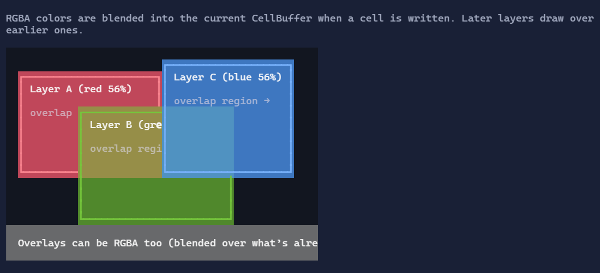

# Rendering & Performance

Rendering is done through an intermediate cell buffer and a diff renderer:

- visuals render into a `CellBuffer`
- a diff renderer computes minimal terminal updates
- output is written in a single batched write per frame where possible

This makes rendering:

- deterministic (a frame is always a complete buffer),
- fast (diffing avoids rewriting unchanged areas),
- compatible with both fullscreen and inline/live hosting.

## Why a cell buffer?

Terminals are *stateful*. If you write a line and then later move the cursor and overwrite a few characters, the terminal
keeps the rest of the previous frame. That makes it hard to reason about rendering correctness, clipping, and focus
effects.

XenoAtom.Terminal.UI instead treats each frame as a **complete 2D buffer**:

- every visual renders into a `CellBuffer`
- the buffer represents the *entire desired terminal state* for that frame
- a diff renderer compares the new buffer to the previous buffer and emits minimal ANSI updates

This is the same high-level approach used by many modern retained-mode UI systems: render to an intermediate
representation, then efficiently update the output.

## Render pipeline (high level)

In a typical frame, the app performs:

1. **Dynamic update** (optional): controls may rebuild children based on state.
2. **Prepare**: controls compute internal state needed for layout/render (e.g. scroll versions).
3. **Measure**: controls compute `SizeHints` given `LayoutConstraints`.
4. **Arrange**: controls receive a final `Rectangle` and position children.
5. **Render**: controls paint into the `CellBuffer`.
6. **Host render**: the diff renderer writes ANSI output to the terminal.

> [!IMPORTANT]
> Rendering must be side-effect free. Don’t mutate bindable state in `RenderOverride`.

## Synchronized output (DEC private mode 2026)

Fullscreen and inline rendering use synchronized output to reduce tearing:

- “begin synchronized output” is emitted at the start of a frame
- “end synchronized output” is emitted at the end

## Cursor handling

The framework uses the terminal cursor as the caret for text controls:

- only one cursor is visible at a time
- controls report desired cursor position during rendering

## CellBuffer basics

`CellBuffer` is a 2D grid of cells. Each cell is a tuple of:

- a `Rune` (glyph),
- a `Style` (foreground/background/text decorations),
- optional metadata (e.g. hyperlink token).

Controls render by calling:

- `buffer.SetCell(x, y, rune, style)`
- `buffer.WriteText(x, y, span, style)`

### Coordinate space

`CellBuffer` coordinates are **integer cell coordinates**:

- `x` is the column (0..Width-1)
- `y` is the row (0..Height-1)

Most controls use their `Bounds` (a `Rectangle`) as their render region:

```csharp
var rect = Bounds;
for (var y = rect.Y; y < rect.Y + rect.Height; y++)
{
    for (var x = rect.X; x < rect.X + rect.Width; x++)
    {
        buffer.SetCell(x, y, new Rune(' '), backgroundStyle);
    }
}
```

### Clipping

The buffer is clipped by the visual tree while rendering. For performance, many controls start with a quick clip check:

```csharp
if (!buffer.ClipIntersects(rect))
{
    return;
}
```

### Text, graphemes, and wide characters

Terminals render in **cells**, but Unicode characters do not map 1:1 to cells:

- some glyphs are **wide** (CJK, emoji) and occupy 2 cells
- some sequences are **grapheme clusters** (e.g. emoji with variation selectors) and should be treated as one visual unit

`CellBuffer.WriteText` handles this by iterating text elements and measuring their cell width with
`TerminalTextUtility`. If an element is wider than 1 cell, the buffer marks the subsequent cell(s) as **continuations**.

> [!TIP]
> When writing custom text rendering, prefer `buffer.WriteText(...)` or measure using `TerminalTextUtility` so that your
> control behaves correctly with wide/complex Unicode.

### Style inheritance (overlay rendering)

Controls often render in layers:

1) fill a background
2) render children
3) draw focus rings, selection highlights, markers, etc.

`CellBuffer.SetCell` merges the incoming style with the existing cell style using `Style.MergeUnspecified(...)`.
That means:

- if you write a cell with `Style.None.WithForeground(...)` it keeps the previous background
- if you write a cell with `Style.None.WithBackground(...)` it keeps the previous foreground (unless you override it)

This pattern is used heavily across the library (e.g. list rows fill their row background so the item visuals can inherit
that style).

## Diff renderer

After rendering a frame, the diff renderer compares the new `CellBuffer` to the previous frame and emits only the
necessary updates.

This is why many “live” UIs can run at 60 FPS without flicker: unchanged areas produce no output.

> [!NOTE]
> Some situations force a full repaint (for example after a resize, or when the host can’t safely preserve previous state).

## Alpha-aware colors (RGB + RGBA)

Unlike many terminal UI libraries, XenoAtom.Terminal.UI supports **alpha-aware colors** via `Color.RgbA(r,g,b,a)`.

This enables modern UI effects such as:

- subtle hover overlays,
- soft surfaces,
- dimmed backdrops behind modal dialogs,
- “lifted” panels using translucent highlights.

Internally, alpha colors are **blended** during rendering so that stacked overlays produce stable results. The final
terminal output is still a concrete color per cell (terminals don’t have real alpha), but the blending makes layered UIs
look consistent.

### How alpha blending works

Alpha blending happens **when a cell is written**.

`CellBuffer.SetCell`:

1) reads the existing cell style (the “under” layer)
2) merges unspecified parts from the under style into the new style
3) if the *overlay* contains `ColorKind.RgbA`, it blends the RGBA color over the resolved destination color

Rules:

- only **RGBA** colors are blended (`ColorKind.RgbA`)
- palette colors (`Default`, `Basic16`, `Indexed256`) are treated as opaque and never blended
- blending is performed in **linear color space** using lookup tables for speed and stable output
- the result is stored as an **opaque** `ColorKind.Rgb` (because terminals can’t represent alpha in SGR)

Blending is applied for:

- **background RGBA**: blended over the existing background color
- **foreground RGBA**: blended over the resolved background for that cell (foreground is “painted over” the background)

> [!NOTE]
> If the destination background is not RGB (e.g. a palette color), alpha is ignored and the RGBA is treated as an
> opaque RGB color. This keeps output deterministic across terminals with different color capabilities.

### Alpha blending demo

The following screenshot is generated from the ControlsDemo and shows three translucent panels overlapping. The overlap
regions are computed by the `CellBuffer` blending algorithm:

{.terminal}

You can reproduce it by running the ControlsDemo and opening the **Rendering → Alpha blending** page.

> [!TIP]
> Prefer alpha overlays for “soft” elevation, but avoid stacking many translucent layers over large areas if your UI is
> extremely dynamic; it increases per-cell work.

## Avoiding allocations

The rendering path reuses internal buffers where possible to minimize per-frame allocations.

## Capturing raster screenshots (CellBuffer → PNG/JPEG/WebP)

For pixel-accurate screenshots, use the companion package `XenoAtom.Terminal.UI.Extensions.Screenshot`.
It renders the `CellBuffer` through SkiaSharp and ships with an embedded `CaskaydiaCoveNerdFont-Regular.ttf`
default font so the demo screenshots include Nerd Font glyphs without requiring local font installation.

This is useful for:

- deterministic documentation screenshots,
- PNG/JPEG/WebP assets for websites and docs,
- verifying how terminal cells snap to real pixels with a specific font configuration.

> [!NOTE]
> All control screenshots in these docs are **generated automatically** from the `ControlsDemo` using the same rendering
> pipeline as a real app. They are not hand-made images.

Install the package:

```shell
dotnet add package XenoAtom.Terminal.UI.Extensions.Screenshot
```

### TerminalApp screenshot helpers

When you run a fullscreen app (or any `TerminalApp`), you can save the last rendered frame directly:

```csharp
using XenoAtom.Terminal.UI.Extensions.Screenshot;

// After the app has rendered at least one frame:
app.SaveScreenshot("screenshot.png");
```

You can also capture a specific visual from the current frame buffer (cropped to its arranged bounds):

```csharp
using XenoAtom.Terminal.UI.Extensions.Screenshot;

app.SaveScreenshot(myControl, "my-control.png", padding: new Thickness(1));
```

### TerminalAppSnapshotImageRenderer

For automation (docs/tests), `TerminalAppSnapshotImageRenderer` renders a visual tree to an in-memory terminal backend
and saves the resulting image:

```csharp
using XenoAtom.Terminal.UI.Extensions.Screenshot;

TerminalAppSnapshotImageRenderer.Save(
    root,
    "snapshot.png",
    width: 120,
    height: 30,
    theme: Theme.ElderberryDarkSoft);
```

### CellBufferImageExporter

At the lowest level, `CellBufferImageExporter` converts any `CellBuffer` to PNG, JPEG, or WebP:

```csharp
using XenoAtom.Terminal.UI.Extensions.Screenshot;

CellBufferImageExporter.Export(buffer, "buffer.png", new CellBufferImageExportOptions
{
    AutoCrop = true,
    Padding = new Thickness(1),
    FillBackground = true,
    Font = new ScreenshotFontOptions
    {
        SizePx = 18,
        Path = "C:/fonts/MyTerminalFont.ttf"
    }
});
```

`CellBufferImageExportOptions` supports cropping, padding, background fill, output quality, and font/cell sizing.

### SVG export

The dependency-free SVG path remains available in the core package through `TerminalApp.CaptureSvg(...)`,
`TerminalAppSnapshotRenderer.RenderSvg(...)`, and `CellBufferSvgExporter.Export(...)`.

## Writing fast custom controls

### Implementing `RenderOverride`

Controls typically follow a predictable pattern:

1) bail out if there is nothing to draw
2) resolve styles based on the theme and state
3) fill the background surface (so children can inherit predictable colors)
4) render content/children
5) draw chrome (borders, focus, markers)

Example:

```csharp
protected override void RenderOverride(CellBuffer buffer)
{
    var rect = Bounds;
    if (rect.Width <= 0 || rect.Height <= 0 || !buffer.ClipIntersects(rect))
    {
        return;
    }

    var theme = GetTheme();
    var style = GetStyle<MyControlStyle>();

    var background = style.ResolveBackground(theme, HasFocus);
    for (var y = rect.Y; y < rect.Y + rect.Height; y++)
    {
        for (var x = rect.X; x < rect.X + rect.Width; x++)
        {
            buffer.SetCell(x, y, new Rune(' '), background);
        }
    }

    // Render content (children usually render after this control returns).
    buffer.WriteText(rect.X + 1, rect.Y, "Hello", style.ResolveText(theme));

    // Draw a simple border.
    var border = style.ResolveBorder(theme, HasFocus);
    buffer.SetCell(rect.X, rect.Y, new Rune('['), border);
    buffer.SetCell(rect.X + rect.Width - 1, rect.Y, new Rune(']'), border);
}
```

Guidelines:

- Prefer measuring text using `TerminalTextUtility` (handles grapheme width).
- Fill backgrounds explicitly when you want predictable inheritance (`Style.None` can inherit from what you wrote before).
- Use `Span<T>`/`ReadOnlySpan<T>` APIs for text and avoid allocating substrings in render loops.

## Related

- [Binding](binding.md)
- [Layout](layout.md)
- [Styling](styling.md)
