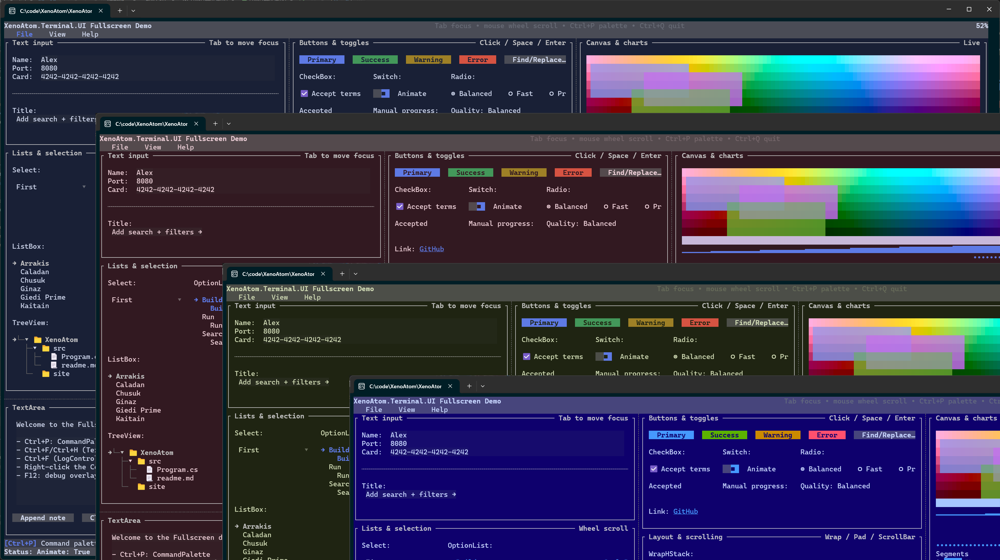
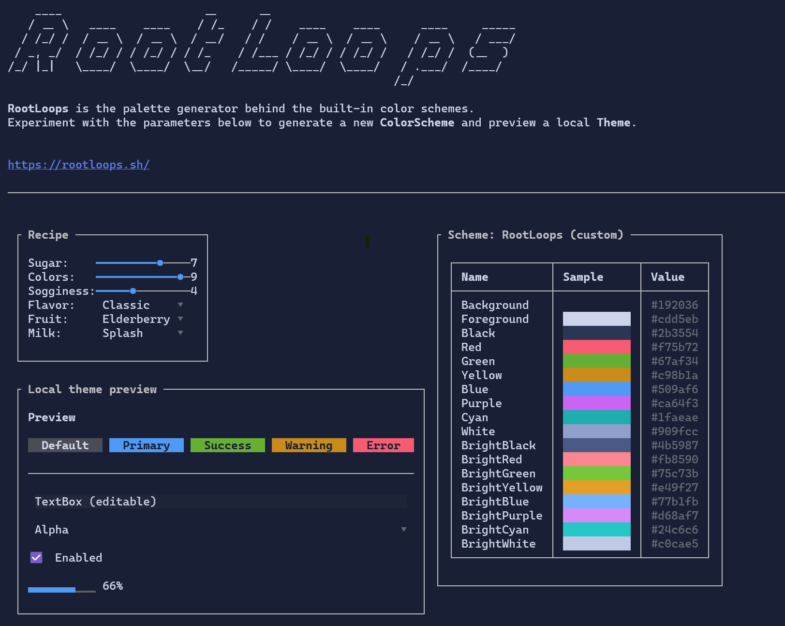

# Styling & Themes

XenoAtom.Terminal.UI uses a theme/style model built on ANSI colors and cell styling.

{.terminal}

## Theme

`Theme` is a set of style values used as the default environment for visuals.

- Fullscreen apps typically use `Theme.Default` (RGB scheme).
- Inline/live widgets typically use `Theme.Terminal` (uses terminal default colors).

Themes are resolved from the environment (`Visual.GetTheme()`), and can be overridden per subtree.

### Applying a theme

```csharp
using XenoAtom.Terminal.UI.Controls;
using XenoAtom.Terminal.UI.Styling;

var themed = new Group(new TextArea("Themed region"))
    .Style(Theme.FromScheme(ColorScheme.CherryDark));
```

## What a Theme contains

`Theme` is intentionally “semantic”: controls mostly consume design tokens such as:

- `Surface`, `PopupSurface`: background surfaces
- `ControlFill`, `ControlFillHover`, `ControlFillPressed`: button-like fills
- `InputFill`, `InputFillFocused`: text input surfaces
- `Border`, `FocusBorder`: stroke colors
- `Accent`, `Selection`: key interaction colors

> [!NOTE]
> For RGB schemes, many tokens are derived using subtle **alpha overlays**. This is how the default theme achieves
> “lifted” panels and soft hover effects without hard-coded colors.

## Styles

Controls obtain their styles from the environment:

```csharp
new Button("OK").Style(new ButtonStyle { Tone = ControlTone.Primary })
```

Styles can also be resolved dynamically from a factory (dependency-tracked):

```csharp
var danger = new State<bool>(false);

new Button("Deploy")
    .Style(() => danger.Value
        ? (ButtonStyle.Default with { ShowBorder = true })
        : ButtonStyle.Default);
```

And styles can come from a binding:

```csharp
var buttonStyle = new State<ButtonStyle>(ButtonStyle.Default);

new Button("Apply").Style(buttonStyle);
```

> [!NOTE]
> Style resolution follows normal environment lookup rules: nearest visual with a local value wins.
> Values set by `Style(...)`, `SetStyle(...)`, factories, and bindings all participate in this lookup.

Styles are records, so variations can be created with `with`:

```csharp
var danger = ButtonStyle.Default with { Tone = ControlTone.Error };
```

## Color schemes

`ColorScheme` represents a 16-color scheme.
Schemes can be:

- terminal-indexed (`Color.Basic16(...)`)
- RGB (`Color.Rgb(...)` / `Color.RgbA(...)`)

### Root Loops schemes (built-in + generator)

XenoAtom.Terminal.UI ships with a set of curated color schemes generated with **Root Loops**:

- Website: https://rootloops.sh by Ham Vocke
- Generator code: `ColorScheme.Generate(...)`
- Predefined schemes: `ColorScheme.GetPredefinedSchemes()`

{.terminal}

`Theme.Default` and `Theme.DefaultLight` are built from:

- `ColorScheme.RootLoopsDark`
- `ColorScheme.RootLoopsLight`

You can list all built-in schemes (for example in a demo):

```csharp
var schemes = ColorScheme.GetPredefinedSchemes();
```

## Alpha blending (RGBA)

XenoAtom.Terminal.UI supports alpha-aware colors via `Color.RgbA(r,g,b,a)`.
Even though the terminal ultimately renders a single color per cell, alpha colors are blended during rendering so
overlays and lifted surfaces look consistent.

Guidance:

- Use low alpha for hover/focus overlays (e.g. `0x10` to `0x40`).
- Prefer themes for most colors; use raw RGB(A) for special-purpose visuals.

## Glyphs

Rendering glyphs (borders, scrollbars, etc.) are stored in styles using `Rune` so controls can be re-themed without changing behavior.

See also:

- [Button](controls/button.md)
- [Border](controls/border.md)
- [Rendering](rendering.md)
