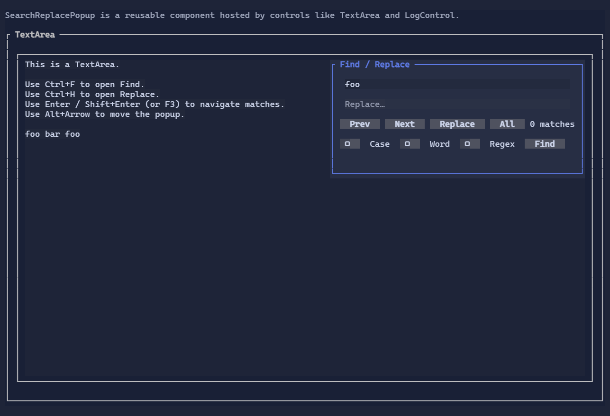

# Text Editing

Text input is a first-class feature of XenoAtom.Terminal.UI: you get a shared editing engine across multiple controls,
with selection, clipboard, undo/redo, scrolling, and integrated Find/Replace.

{.terminal}

## Controls built on the text infrastructure

These controls share the same editing engine and most of the same user experience:

- [TextBox](controls/textbox.md) — single-line editor, password mode, overflow indicators
- [TextArea](controls/textarea.md) — multi-line editor, soft wrapping, Find/Replace popup
- [MaskedInput](controls/maskedinput.md) — structured templates (credit cards, dates, IDs, etc.)
- [NumberBox](controls/numberbox.md) — numeric value binding with inline validation
- [PromptEditor](controls/prompteditor.md) — prompt-style editor with single-line or multi-line modes and configurable command hints for accept/new-line workflows

Other controls also *use* the same infrastructure for parts of their UX:

- [SearchReplacePopup](controls/searchreplacepopup.md) — reusable Find / Replace UI (hosted by TextArea and LogControl)
- [LogControl](controls/logcontrol.md) — selection/copy + Find (Ctrl+F)
- [DataGridControl](controls/datagrid.md) — in-place editing uses text editors (e.g. TextBox/NumberBox)

## Editing features

Across the editors above you typically get:

- **Caret + selection**: keyboard and mouse selection, text element (grapheme) aware navigation.
- **Clipboard**: copy/cut/paste shortcuts when enabled by the control’s clipboard mode/settings.
- **Undo/redo**: built-in history (`Ctrl+Z` / `Ctrl+R`) integrated with programmatic edits.
- **Overflow + scrolling**:
  - Single-line editors provide overflow indicators when content is wider than the viewport.
  - Multi-line editors integrate with `ScrollViewer` via `IScrollable`.

> [!TIP]
> Most controls expose their shortcuts as commands, so a focused editor can be discoverable via a `CommandBar`.

## Undo / redo

Text editors support undo/redo:

- `Ctrl+Z`: undo
- `Ctrl+R`: redo

See [Undo/Redo](undo-redo.md).

## Find / Replace

`TextArea` includes a built-in Find / Replace UI powered by the reusable [SearchReplacePopup](controls/searchreplacepopup.md):

- `Ctrl+F`: Find
- `Ctrl+H`: Replace

The same popup component is also used by other controls (for example, `LogControl` hosts it in Find-only mode).

> [!NOTE]
> Find/Replace is hosted by the editor control and rendered as a window-layer popup in fullscreen apps. The host keeps the popup
> anchored to the editor and forwards query/navigation updates through an `ISearchReplaceTarget`.

## Scroll integration

Text editors that can extend beyond their viewport implement `IScrollable`, so they integrate naturally with `ScrollViewer`:

```csharp
new ScrollViewer(new TextArea(longText))
```

## How it works (conceptual)

The text editing stack is split into a few focused parts:

- **`TextEditorBase`**: shared control base for editors (focus, commands, cursor integration).
- **`TextEditorCore`**: editing behavior (navigation, selection, word operations, clipboard, undo/redo, search matches).
- **`ITextDocument`**: document abstraction for storage and edits.
  - `TextDocument`: a simple document implementation.
  - `DynamicTextDocument`: bridges a bindable `Text` property to the editor engine.
- **`ScrollModel`**: viewport/extent model used by `IScrollable` controls and `ScrollViewer`.

For large documents, the multi-line editor path caches per-line widths and wrap metadata, updates those caches incrementally
after document changes, and renders only the visible rows instead of rescanning the entire document on each frame. Extremely
long wrapped lines use sparse row checkpoints plus a small reusable cache of fixed-size wrapped-row blocks, so keyboard
navigation, PageUp/PageDown, mouse wheel scrolling, and scrollbar drags can jump quickly without materializing every wrapped
row offset or allocating per-row navigation state while moving through the document.

Mouse-wheel scrolling is handled by hosting scrolling containers such as `ScrollViewer`; text editors themselves do not
consume wheel input directly.

The caret is rendered using the terminal cursor (not a fake reverse-video “block” cell), which keeps rendering stable and works well
with accessibility settings in many terminals.

## See also

- [TextBox](controls/textbox.md)
- [TextArea](controls/textarea.md)
- [MaskedInput](controls/maskedinput.md)
- [NumberBox](controls/numberbox.md)
- [PromptEditor](controls/prompteditor.md)
- [SearchReplacePopup](controls/searchreplacepopup.md)
- [Binding & State](binding.md)
- [Input](input.md)
- [Undo/Redo](undo-redo.md)
- [Text Editor Specs](specs/text_editor_specs.md)
